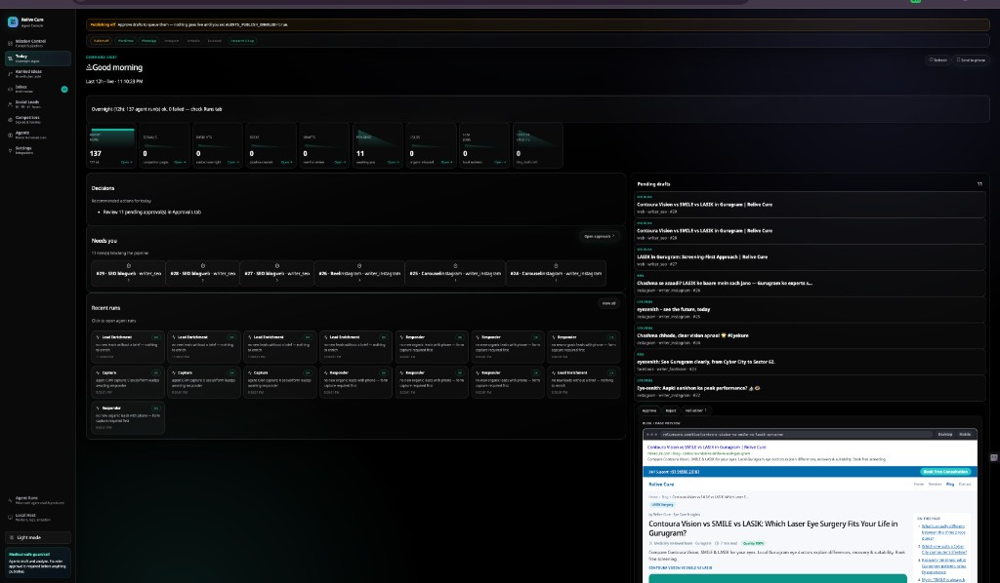
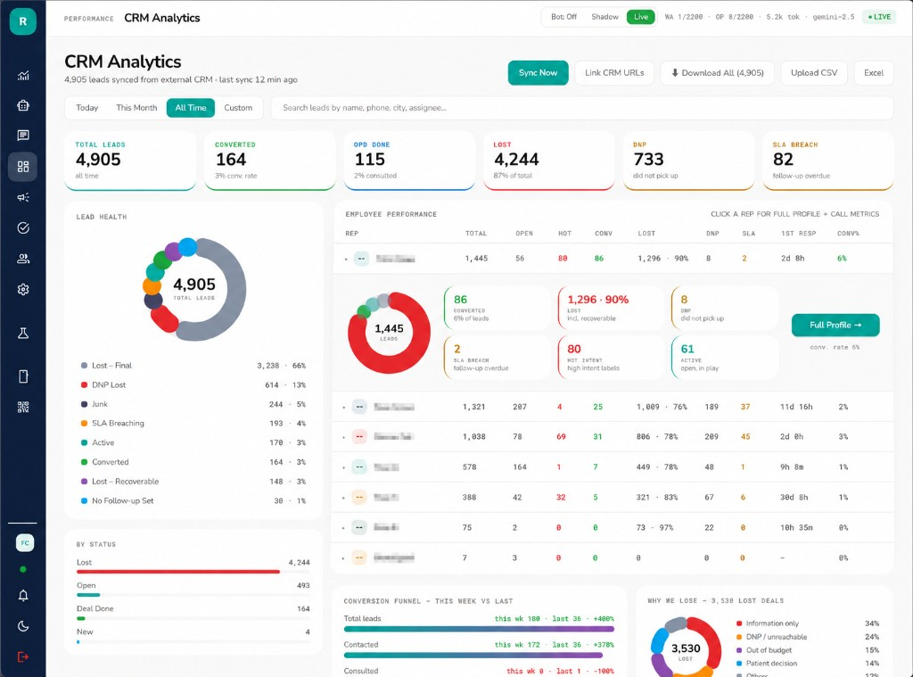
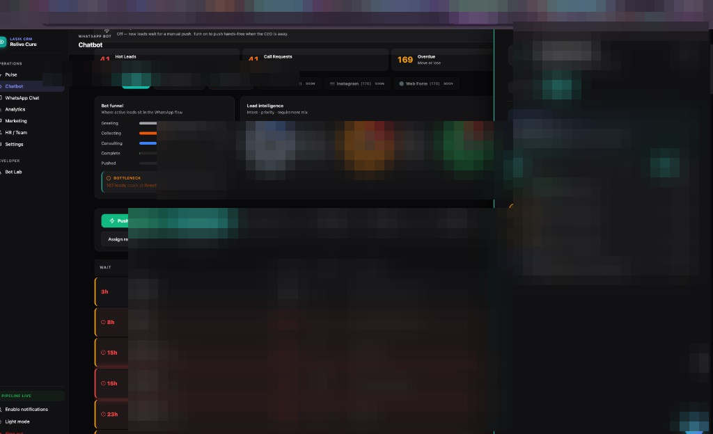

# Relive Cure — Healthcare Lead Ops (Showcase)

> **Public overview only.** Application source is private (`relive-cure-dashboard`, `relive-cure-backend`).  
> This repo exists for portfolio reference — screenshots use the real UI with **sensitive fields blurred**.

Relive Cure is a LASIK clinic I operate and the software that runs it. Two surfaces do most of the work:

1. **Agent Console** — AI agents that drive **organic marketing** (content pipeline, drafts, multi-channel publishing).
2. **CRM Analytics** — the **ops command center** where leads, reps, SLAs, and funnel health live.

Inbound from ads, WhatsApp, and organic social flows through qualification → CRM → rep assignment → appointment.

---

## 1. Agent Console — organic marketing with AI agents

The Agent Console is not a chatbot skin. It is a **marketing operations layer**: agents run overnight, rank what matters, draft channel-specific content, and queue everything for founder approval before anything publishes.

**Medical-safe by design** — agents draft and analyze; founder approval is required before anything publishes. Publishing can be gated off entirely until explicitly enabled.

### What the agents do

| Step | What happens |
|------|----------------|
| **Monitor** | Competitor signals, market context, overnight activity digest |
| **Rank** | Content insights scored and ordered into a growth plan |
| **Generate** | Pipeline ideas → channel-specific drafts (Facebook, Instagram, SEO blog, reels) |
| **Queue** | Drafts land in an inbox — Approve / Reject / Full editor |
| **Publish** | WordPress, WhatsApp, Instagram, LinkedIn, Facebook, Pinterest, Google Maps (when enabled) |

### Console surfaces

| Area | What you see |
|------|----------------|
| **Today** | Overnight digest — agent runs, pending approvals, what needs you |
| **Ranked Ideas** | Growth plan table from overnight research |
| **Inbox** | Draft review queue with live blog/page preview |
| **Social Leads** | Organic inbound from IG, FB, LI, forms |
| **Agents** | Roster, manual runs, worker status |

### Overnight loop (example)

```
Competitor + market signals
    → agents rank insights & create pipeline ideas
    → writers produce drafts per channel (SEO, Instagram, Facebook)
    → founder reviews pending drafts in inbox
    → approved content publishes to organic channels
    → inbound interest routes to CRM / WhatsApp qualification
```

Typical overnight output: 100+ agent runs, ranked insights, pipeline ideas, and multiple drafts ready for approval — without manual content research each morning.

### Screenshot — Agent Console



*Agent runs, "Needs you" queue, pending SEO/Instagram drafts with live preview, platform integrations. Sensitive fields blurred.*

---

## 2. CRM Analytics — the command center

The CRM is where operations actually run: **4,900+ leads** synced from Refrens, funnel health, rep performance, SLA breaches, and channel status — one screen the sales floor and I both use daily.

### What it tracks

| Area | Detail |
|------|--------|
| **Funnel** | Total leads, converted, OPD done, lost, DNP, SLA breach counts |
| **Lead health** | Status distribution donut — lost, active, converted, junk, hot intent |
| **Rep performance** | Per-rep conversion, response time, SLA, OPD booked — expandable profiles |
| **Channels** | WhatsApp bot status (off / shadow / live), token usage, Gemini model indicator |
| **Sync** | Refrens CRM pull, CSV/Excel export, bulk download |
| **Loss analysis** | Why we lose — information-only, DNP, budget, and other breakdowns |
| **Week-over-week** | Conversion funnel comparison — contacted, converted, trends |

Five reps run on this daily. When a workflow breaks in the morning, I see it here and ship the fix the same day — operator and engineer in one seat.

### Screenshot — CRM Analytics



*Refrens-synced analytics: KPI row, lead health donut, rep table, conversion funnel vs last week. Sensitive fields blurred.*

---

## How the two surfaces connect

```
Organic / paid inbound          Agent-generated content
        │                                │
        ▼                                ▼
   WhatsApp / forms              Social + SEO channels
        │                                │
        └──────────┬─────────────────────┘
                   ▼
        AI qualification (multi-language)
                   ▼
           CRM ingest + scoring
                   ▼
         Rep assignment + SLA bands
                   ▼
              Appointment booked
```

| Surface | Role |
|---------|------|
| **Agent Console** | Organic marketing engine — insights, drafts, approval, publish |
| **Consultation chatbot** | Qualifies inbound interest on WhatsApp ([overview](https://github.com/jaskiringg/lasik-consultation-bot)) |
| **CRM dashboard** | Ops inbox, KPIs, funnel, rep performance |
| **Lead scoring board** | Fair distribution + SLA-aware prioritization ([overview](https://github.com/jaskiringg/lead-scoring-dashboard)) |
| **Backend API** | Lead ingest, sync, scoring hooks, agent orchestration |

---

## More screenshots

### Consultation chatbot (WhatsApp qualification)


---

## Stack (high level)

React · Vite · Node/Express · Supabase · WhatsApp Cloud API · Gemini · agent orchestration

---

## Related overviews

- [Consultation bot](https://github.com/jaskiringg/lasik-consultation-bot) — WhatsApp qualification flow
- [Lead scoring](https://github.com/jaskiringg/lead-scoring-dashboard) — fair assignment + SLA bands

## Private source (invite-only)

- `relive-cure-dashboard` / `relive-cure-dashboard-v2` — CRM UI + Agent Console
- `relive-cure-backend` — API, WhatsApp engine, agent jobs
- `lasik-whatsapp-bot` · `lead-intelligence`

Collaborator: [@siddharth555555](https://github.com/siddharth555555)

---
*No application source in this repository — showcase README and blurred screenshots only.*

## Portfolio case studies

- [Clinic ops case study](docs/portfolio/CASE_STUDY.md) (anti-clone redacted)
- [Enterprise voice agent essay](docs/portfolio/VOICE_AGENT_ESSAY.md)
- Atlas: https://jaskiring.up.railway.app/work/relivecure
