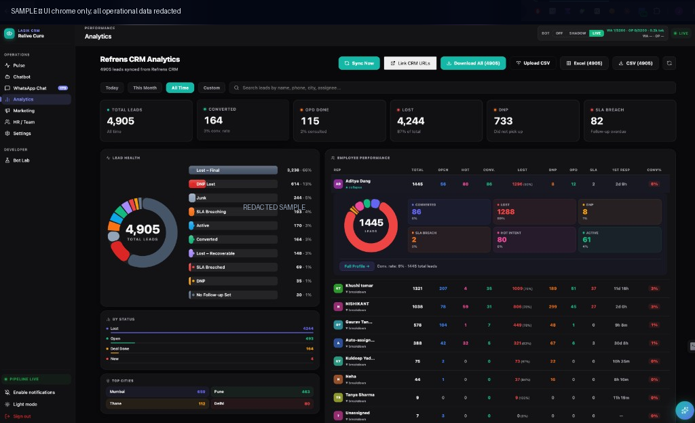
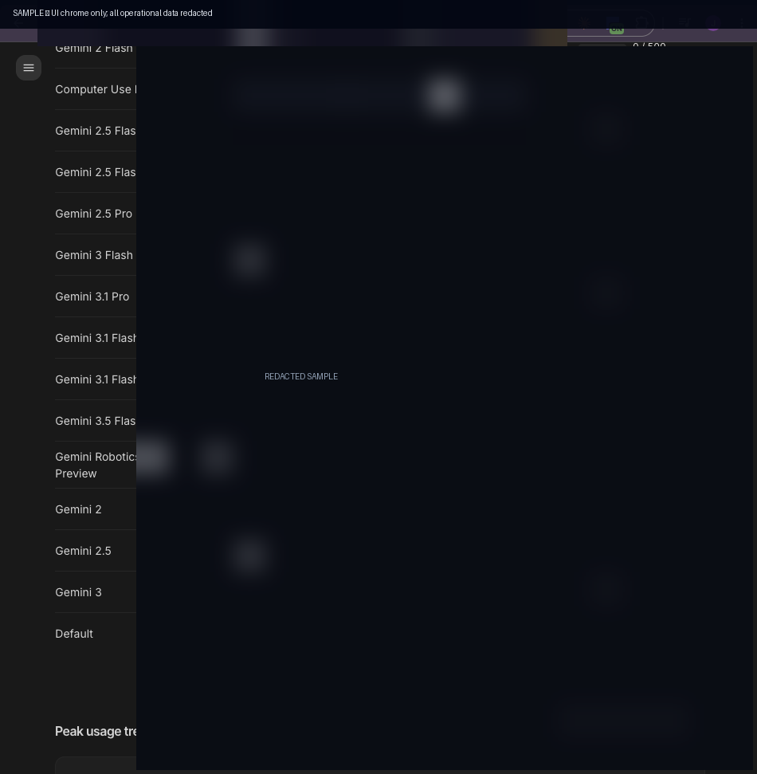
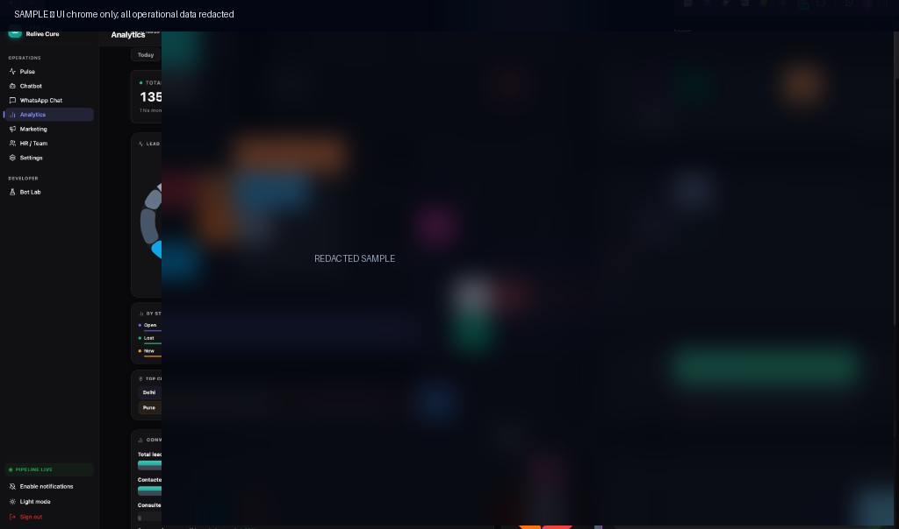
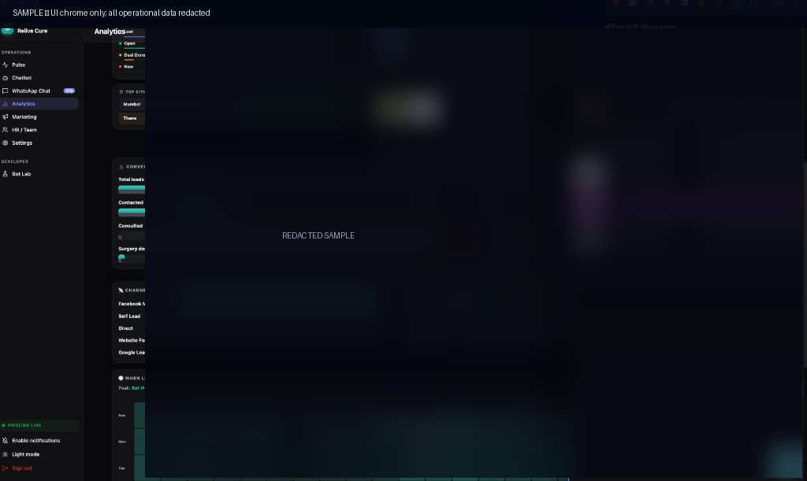

# Relive Cure — Product CRM (Showcase)

> **Public overview only.** Application source is private.  
> Screenshots are **anonymized** (names, phones, messages, and URLs removed).

End-to-end **patient lead operations** system for a specialty clinic: inbound chat → qualification → CRM sync → analytics → rep workflows.

## What it is

A multi-surface product:

| Surface | Role |
|---|---|
| Consultation chatbot | Qualifies inbound interest on WhatsApp (multi-language) |
| CRM dashboard | Ops inbox, KPIs, funnel, rep performance |
| Backend API | Lead ingest, sync, scoring hooks, agent tooling |
| Lead scoring board | Fair distribution + SLA-aware prioritization |

## How it works

```
Inbound message
    → language-aware conversation flow
    → structured lead fields captured
    → backend ingest + CRM sync
    → dashboard: queue, analytics, rep views
    → optional scoring / assignment for sales floor
```

1. **Capture** — chatbot collects intent and contact context without staff typing every reply  
2. **Normalize** — backend stores events, signals, and status transitions  
3. **Operate** — dashboard shows queues, hot items, funnel health, and assignee views  
4. **Improve** — analytics (funnel, loss reasons, channel mix) guide process tweaks  

## Screenshots (redacted UI shell)

### Ops shell


### Chatbot operations view


### Analytics


### Lead / rep detail drawers (data removed)



## Stack (high level)

React · Vite · Node/Express · Supabase · WhatsApp Cloud API · Streamlit (scoring board)

## Related public overviews

- [Consultation bot overview](https://github.com/jaskiringg/lasik-consultation-bot)
- [Lead scoring overview](https://github.com/jaskiringg/lead-scoring-dashboard)

## Source access

Private implementation repos (invite-only). Collaborator: [@siddharth555555](https://github.com/siddharth555555).

---
*This repository intentionally contains no application source.*
